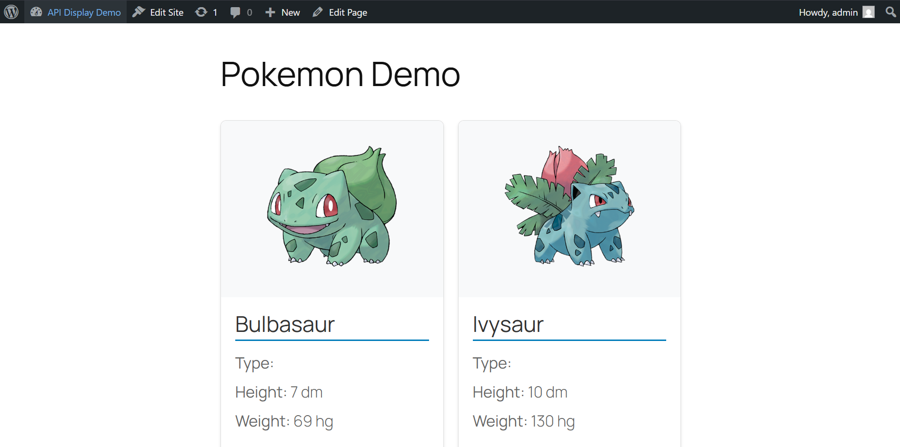

# Pokemon API Plugin

A WordPress plugin that fetches and displays Pokémon data from the public [PokéAPI] using shortcodes.  
Includes caching and error handling.

---

## File Structure

pokemon-api-plugin/
│
├── assets/
│ └── style.css
│
├── includes/
│ ├── api-handler.php
│ └── shortcode.php
│
├── pokemon-api-plugin.php
└── README.md

## Features

- **Integration with RESTful API**  
  Uses WordPress’s built-in `wp_remote_get()` function to call the PokéAPI endpoints.
- **Caching with Transients**  
  Repeated API calls within 1 hour are served from cache using `set_transient`.
- **Fallbacks**  
  Displays error messages if data retrieval fails or if the API returns empty data.

## Sources & Resources Used

- **Wordpress Developer Resources**
  https://developer.wordpress.org/reference/functions/wp_remote_get/
- **VSCode with CoPilot IDE extension**

## Installation & Setup

**2. Install Wordpress**
- Install [XAMPP]
- Place the `wordpress/` folder inside `htdocs/` (for XAMPP).
- Start Apache and MySQL from your control panel.
- Visit `http://localhost/phpmyadmin` and create a database (e.g., `wp_test`).
- Install WordPress at `http://localhost/wp-test`.

**2. Activate and view plugin**
- Log into the WordPress admin dashboard at `http://localhost/wp-test/wp-admin`.
- Go to **Plugins → Installed Plugins**.
- Activate **Pokemon API Plugin**.
- Create a new page in WordPress.
- Add this shortcode in the page content: [pokemon_api_data type="pokemon" limit="8"]

